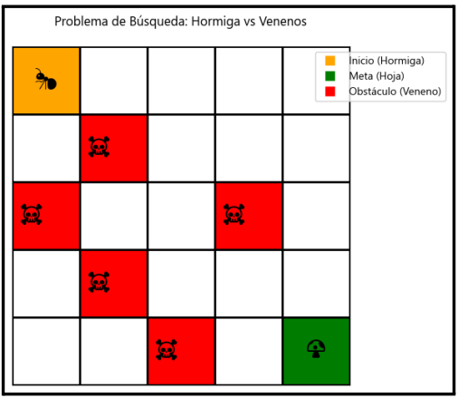

# Proyecto: La Hormiga y el Hongo Mágico
**Universidad del Valle - Introducción a la Inteligencia Artificial**



## Descripción

Este proyecto implementa una solución al problema clásico donde una hormiga debe encontrar el hongo mágico en un mapa representado como una matriz. El mapa contiene:
- Casillas libres (costo 1)
- Obstáculos (intransitables)
- Venenos (costo 5, pero transitables)
- Punto de inicio (hormiga)
- Punto objetivo (hongo mágico)

## Algoritmos Implementados

### 1. Beam Search
Búsqueda informada que limita la cantidad de nodos mantenidos por nivel (ancho de viga β):
- Solo se expanden los β nodos más prometedores según f(n) = g(n) + h(n)
- Los demás nodos se descartan permanentemente
- Ventaja: uso eficiente de memoria
- Desventaja: no garantiza optimalidad

### 2. Dynamic Weighting A*
Variante de A* que ajusta dinámicamente el peso de la heurística:
- Función de evaluación: `f(n) = g(n) + h(n) + ε * (1 - d(n)/N) * h(n)`
  - `d(n)`: profundidad del nodo
  - `N`: profundidad máxima estimada
  - `ε`: parámetro de escala inicial
- Da más peso a h(n) al inicio (exploración rápida) y menos cerca del objetivo (refinamiento)

## Requisitos del Sistema

### Python
- Python 3.8 o superior

### Dependencias
```bash
pip install pygame
```

O instalar desde requirements.txt:
```bash
pip install -r requirements.txt
```

## Instalación

1. Clonar el repositorio:
```bash
git clone <url-del-repositorio>
cd AI_P1
```

2. Instalar dependencias:
```bash
pip install -r requirements.txt
```

3. Ejecutar la aplicación:
```bash
python src/Main.py
```

## Uso de la Interfaz Gráfica

### Controles Principales

**Algoritmos:**
- `Beam Search`: Ejecuta búsqueda Beam con el β configurado
- `Dynamic A*`: Ejecuta Dynamic Weighting A* con el ε configurado

**Animación:**
- `Play`: Inicia la animación automática
- `Pause`: Pausa la animación
- `Step`: Avanza un paso en la animación
- `Reset`: Reinicia la animación al inicio

**Mapa:**
- `Clear Map`: Limpia todo el mapa
- `Save`: Guarda el mapa actual en `map.json`
- `Load`: Carga un mapa desde `map.json`

### Edición del Mapa

En el panel derecho, selecciona el modo de edición:
- **Vacío**: Casilla transitable normal (costo 1)
- **Obstáculo**: Casilla no transitable
- **Veneno**: Casilla con costo alto (costo 5)
- **Inicio**: Posición inicial de la hormiga (verde)
- **Objetivo**: Posición del hongo mágico (rojo)

Luego haz clic en la cuadrícula para colocar el elemento seleccionado.

### Ajuste de Parámetros

**Velocidad (1-20):** Controla la velocidad de la animación (pasos por segundo)

**Beta (β) (1-10):** Ancho de viga para Beam Search
- Valores bajos: más rápido, menos memoria, menor calidad
- Valores altos: más lento, más memoria, mejor calidad

**Epsilon (ε) (0.5-3):** Peso inicial de la heurística para Dynamic Weighting
- Valores bajos: comportamiento más conservador (cercano a A*)
- Valores altos: exploración más agresiva

### Visualización

- **Línea amarilla**: Camino encontrado por el algoritmo
- **Círculo naranja**: Posición actual de la hormiga
- **Panel de estadísticas**: Muestra métricas de la búsqueda
  - Nodos expandidos
  - Nodos generados
  - Longitud del camino
  - Costo total del camino
  - Tiempo de ejecución

## Estructura del Proyecto

```
AI_P1/
├── src/
│   ├── Main.py          # GUI principal con Pygame
│   └── Search.py        # Algoritmos de búsqueda
├── img/
│   └── Problem.png      # Imagen del problema
├── Proyecto.md          # Especificación del proyecto
├── README.md            # Este archivo
├── requirements.txt     # Dependencias Python
└── map.json            # Archivo de mapa (generado al guardar)
```

## Formato del Archivo de Mapa (map.json)

```json
{
  "width": 20,
  "height": 15,
  "grid": [[0, 0, 1, ...], ...],
  "start": [1, 1],
  "goal": [18, 13]
}
```

Valores de celda:
- `0`: EMPTY (vacío)
- `1`: OBSTACLE (obstáculo)
- `2`: POISON (veneno)
- `3`: START (inicio)
- `4`: GOAL (objetivo)

## Experimentos y Análisis

### Sugerencias para Experimentos

1. **Comparación de algoritmos:**
   - Crear varios mapas (pequeño 10x10, mediano 20x15, grande 30x30)
   - Ejecutar ambos algoritmos con diferentes parámetros
   - Comparar: tiempo, nodos expandidos, costo de la solución

2. **Variación de parámetros:**
   - Beam Search: probar β = 1, 3, 5, 10
   - Dynamic Weighting: probar ε = 0.5, 1.0, 1.5, 2.0, 3.0

3. **Mapas con diferentes características:**
   - Mapas con muchos obstáculos (laberintos)
   - Mapas con grandes áreas de veneno
   - Mapas abiertos vs. restringidos

### Métricas a Analizar

- **Completitud**: ¿El algoritmo encuentra solución si existe?
- **Optimalidad**: ¿Qué tan cercano está el costo al óptimo?
- **Eficiencia**: Nodos expandidos y tiempo de ejecución
- **Calidad de la solución**: Longitud y costo del camino

## Características Implementadas

✅ Matriz configurable en tamaño y contenido  
✅ Interfaz gráfica con Pygame  
✅ Visualización de la hormiga moviéndose  
✅ Controles de play/pause/step/reset  
✅ Ajuste de velocidad en tiempo real  
✅ Editor de mapas integrado  
✅ Guardar/cargar mapas (JSON)  
✅ Visualización de estadísticas  
✅ Beam Search con β configurable  
✅ Dynamic Weighting A* con ε configurable  
✅ Animación suave del movimiento  
✅ Visualización del camino encontrado  

## Mejoras Opcionales (Ideas)

- [ ] Soporte para movimiento diagonal (8-vecinos)
- [ ] Múltiples niveles de dificultad predefinidos
- [ ] Exportar estadísticas a CSV
- [ ] Comparación visual lado a lado de ambos algoritmos
- [ ] Modo de visualización paso a paso con expansión de nodos
- [ ] Gráficos de rendimiento (matplotlib)
- [ ] Diferentes tipos de heurísticas seleccionables

## Autores

Proyecto desarrollado para el curso de Introducción a la Inteligencia Artificial  
Universidad del Valle - Escuela de Ingeniería de Sistemas y Computación

## Licencia

Este proyecto es de uso académico para el curso de IA.

## Soporte

Para preguntas o problemas:
1. Revisar este README
2. Consultar `Proyecto.md` para especificaciones
3. Verificar que pygame esté instalado correctamente
4. Revisar los comentarios en el código fuente
